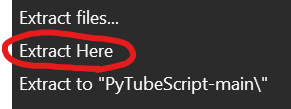

# PytubeScript

## An intuitive Python script to download YouTube videos using [pytubefix](https://github.com/JuanBindez/pytubefix)

---

## Installation

Click on the green button above labelled "< > Code", click on it, and then "Download ZIP" (see below for pictures)

From there you should see a pop-up on screen saying the file has been downloaded (see below).
Click the folder icon next to the download to open it in your downloads folder. 

Right-click the ZIP in your downloads folder and you will be given many different options, the one we're looking for will either be called
"Extract All" or "Extract Here". Click on which ever you see, and extract it to a folder of your choice.
From there open the extracted folder, run the "RUN_ME_FIRST.py" file, wait for it to close and then run the "main.py".
Enjoy!

